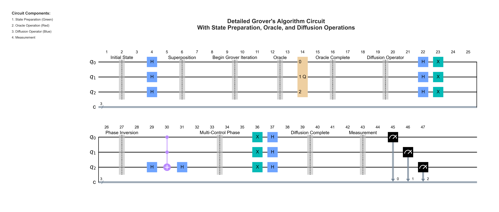
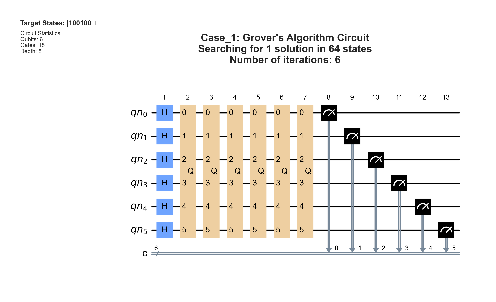
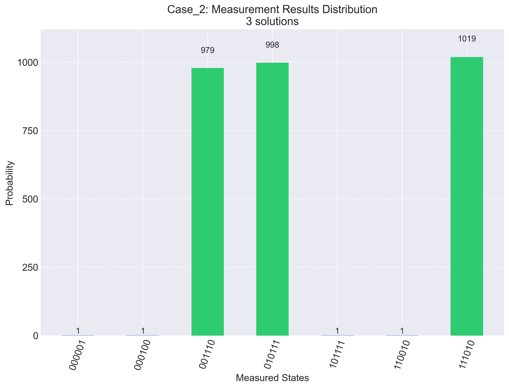
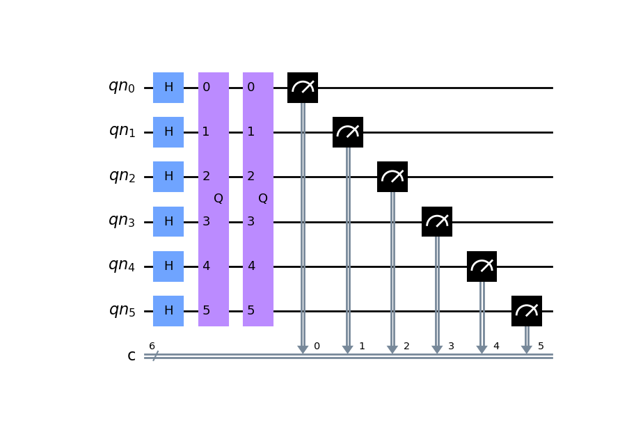

# Grover's Algorithm Implementation

## Overview
This project implements Grover's Algorithm using Qiskit, demonstrating quantum search capabilities through various test cases.



## Features
- Implementation of Grover's Algorithm with configurable parameters
- Multiple test cases demonstrating different search scenarios
- Visualization of quantum circuits and measurement results
- Comprehensive test suite
- Detailed documentation and discussion of results

## Implementation Examples

### Case 1: Single Solution Search

- Searching for state |100100⟩ in 6-qubit space
- Demonstrates precise targeting of single solution

### Case 2: Multiple Solutions

- Successfully identifies three marked states
- Shows balanced probability distribution among solutions

### Case 3: Large Solution Set

- Efficiently handles seven solutions
- Demonstrates algorithm's scalability

## Installation

1. Clone the repository:
```bash
git clone https://github.com/shidsa6/grover-algorithm-project.git
cd grover-algorithm-project
```

2. Create and activate a virtual environment:
```bash
python -m venv qiskit_env
source qiskit_env/bin/activate  # On Windows: qiskit_env\Scripts\activate
```

3. Install dependencies:
```bash
pip install -r requirements.txt
```

## Usage

1. Run the main implementation:
```bash
python grover_algorithm.py
```

2. Run tests:
```bash
python -m unittest tests/test_grover_algorithm.py
```

## Project Structure
```
grover_algorithm/
├── README.md
├── requirements.txt
├── LICENSE
├── grover_algorithm.py
├── discussion.md
├── examples/          # Contains all circuit diagrams and histograms
└── tests/
    └── test_grover_algorithm.py
```

## Results
The implementation includes three test cases:
- Case 1: Single solution search
- Case 2: Three-solution search
- Case 3: Seven-solution search

Results and visualizations are automatically generated in the `examples/` directory.

## Contributing
Contributions are welcome! Please feel free to submit a Pull Request.

## License
This project is licensed under the MIT License - see the [LICENSE](LICENSE) file for details.
