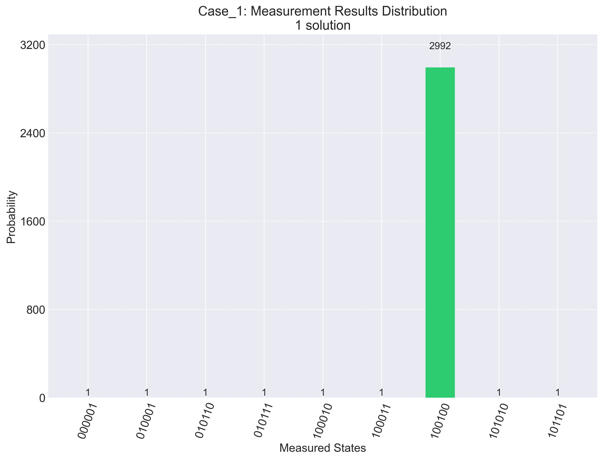
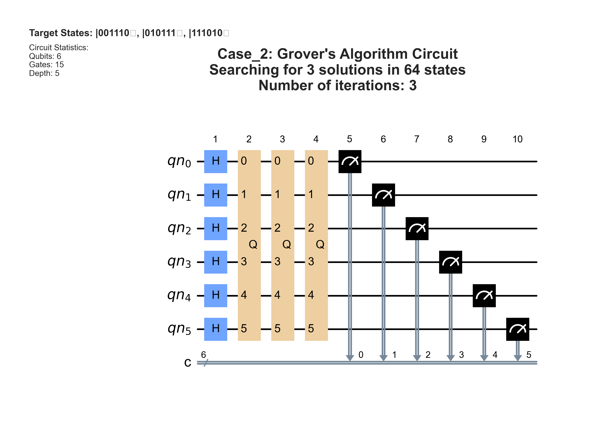

# Grover's Algorithm Project

This project demonstrates Grover's Algorithm implemented using Qiskit. It includes three cases to showcase the algorithm's performance with varying numbers of solutions.

## Overview

Grover's Algorithm is a quantum search algorithm that provides a quadratic speedup compared to classical search algorithms. This project implements and visualizes Grover's Algorithm for the following cases:
- **Case 1**: Single solution.
- **Case 2**: Three solutions.
- **Case 3**: Seven solutions.

## Results

### Generic Circuit
A generic Grover’s Algorithm circuit diagram is included for visualization:


### Case Outputs
Each case generates the following outputs:
1. **Circuit Diagram**: A visual representation of the quantum circuit.
2. **Histogram**: A bar chart of measurement results.

#### Case 1: Single Solution



#### Case 2: Three Solutions



#### Case 3: Seven Solutions


## How to Run

1. Clone the repository and navigate to the project directory.
2. Ensure you have the required dependencies:
   ```bash
   pip install -r requirements.txt
